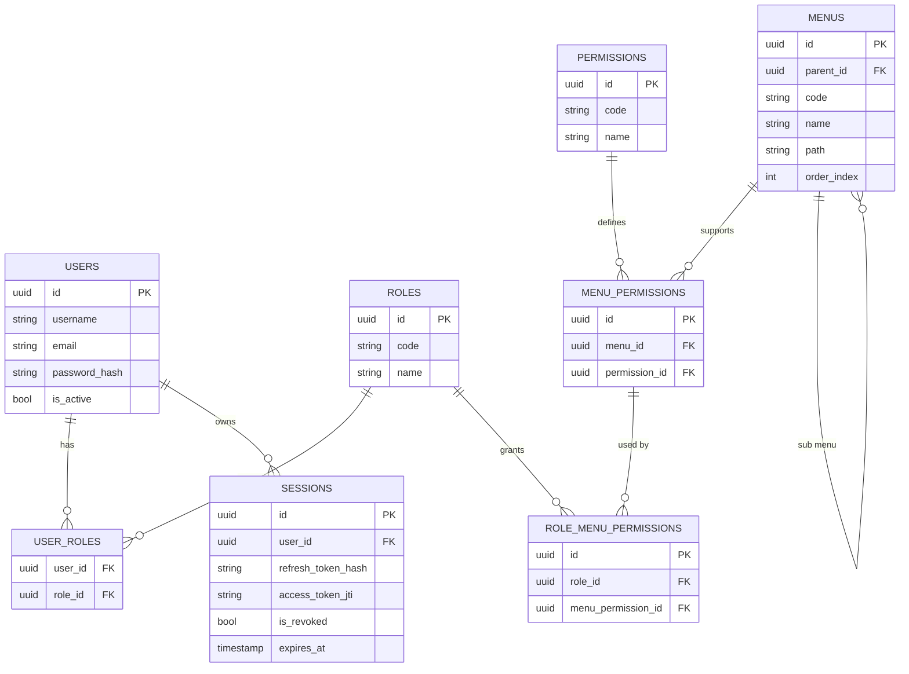

# API Authentication Concept — JWT + Dynamic RBAC (User → Role → Menu → Permission) + Session Control

## 1. Overview

JWT-based authentication system with granular role-based authorization scoped per menu/module. Permissions are dynamic (not hardcoded CRUD) so every menu/endpoint can define its own custom permissions (`export`, `import`, `can_access`, etc.) without schema migrations. The sessions table acts as the source of truth for refresh token validity, so an admin or the user can force logout at any time even if the refresh token's lifetime hasn't expired yet.

## 2. Entity Hierarchy

- **User ↔ Role** — many-to-many. A user can have more than one role, depending on configuration.
- **Role ↔ Menu ↔ Permission** — not a direct Role-Menu relation, but two layers:
  - `menu_permissions` — catalog: which permissions are *available* for a given menu (menu A supports `create/read/update/delete/export`, menu B only supports `can_access`).
  - `role_menu_permissions` — actual grant: out of the permissions available for that menu, which ones a role actually has.
- **Menu** — self-referencing (`parent_id`) to support a nested sidebar tree.
- **Permission** — a dynamic global catalog. Adding a new permission just means inserting one row, no schema change required.
- **Session** — stores the state of each active refresh token per device/login. This is the source of truth for force logout.

## 3. ERD



## 4. Database Schema (Generic / Cross-Engine)

Defined logically (generic types), independent of any specific SQL dialect, so it can be adapted to PostgreSQL, MySQL, SQLite, SQL Server, or MongoDB.

### 4.1 Entity Definitions

**users**

| Field | Type | Constraint |
|---|---|---|
| id | UUID | PK |
| username | String(50) | UNIQUE, NOT NULL |
| email | String(150) | UNIQUE, NOT NULL |
| password_hash | String | NOT NULL |
| is_active | Boolean | NOT NULL, default true |
| created_at | DateTime | NOT NULL |
| updated_at | DateTime | NOT NULL |
| deleted_at | DateTime | NULL |

**roles**

| Field | Type | Constraint |
|---|---|---|
| id | UUID | PK |
| code | String(50) | UNIQUE, NOT NULL |
| name | String(100) | NOT NULL |
| description | String | NULL |
| is_active | Boolean | NOT NULL, default true |
| created_at | DateTime | NOT NULL |
| updated_at | DateTime | NOT NULL |

**user_roles** (pivot, composite PK)

| Field | Type | Constraint |
|---|---|---|
| user_id | UUID | PK, FK → users.id |
| role_id | UUID | PK, FK → roles.id |
| assigned_at | DateTime | NOT NULL |

**menus** (self-referencing tree)

| Field | Type | Constraint |
|---|---|---|
| id | UUID | PK |
| parent_id | UUID | FK → menus.id, NULL |
| code | String(50) | UNIQUE, NOT NULL |
| name | String(100) | NOT NULL |
| icon | String(50) | NULL |
| path | String(150) | NULL |
| order_index | Int | NOT NULL, default 0 |
| is_active | Boolean | NOT NULL, default true |
| created_at | DateTime | NOT NULL |
| updated_at | DateTime | NOT NULL |

**permissions** (dynamic global catalog)

| Field | Type | Constraint |
|---|---|---|
| id | UUID | PK |
| code | String(50) | UNIQUE, NOT NULL |
| name | String(100) | NOT NULL |
| description | String | NULL |
| created_at | DateTime | NOT NULL |

**menu_permissions** (per-menu permission catalog)

| Field | Type | Constraint |
|---|---|---|
| id | UUID | PK |
| menu_id | UUID | FK → menus.id |
| permission_id | UUID | FK → permissions.id |
| — | — | UNIQUE(menu_id, permission_id) |

**role_menu_permissions** (actual grant)

| Field | Type | Constraint |
|---|---|---|
| id | UUID | PK |
| role_id | UUID | FK → roles.id |
| menu_permission_id | UUID | FK → menu_permissions.id |
| created_at | DateTime | NOT NULL |
| — | — | UNIQUE(role_id, menu_permission_id) |

**sessions**

| Field | Type | Constraint |
|---|---|---|
| id | UUID | PK |
| user_id | UUID | FK → users.id |
| refresh_token_hash | String | NOT NULL |
| access_token_jti | UUID | NOT NULL |
| device_info | String(255) | NULL |
| ip_address | String(45) | NULL |
| is_revoked | Boolean | NOT NULL, default false |
| expires_at | DateTime | NOT NULL |
| created_at | DateTime | NOT NULL |
| last_used_at | DateTime | NOT NULL |

Required indexes (all relational engines): `sessions(user_id)`, `sessions(refresh_token_hash)`, `user_roles(role_id)`, `role_menu_permissions(role_id)`.

### 4.2 Type Mapping per Engine (Relational)

| Generic | PostgreSQL | MySQL 8+ | SQLite | SQL Server |
|---|---|---|---|---|
| UUID (PK) | `UUID` | `CHAR(36)` or `BINARY(16)` | `TEXT` | `UNIQUEIDENTIFIER` |
| Generate UUID | `gen_random_uuid()` (pgcrypto) | `UUID()` or generated in app | generated in app | `NEWID()` |
| String(n) | `VARCHAR(n)` | `VARCHAR(n)` | `TEXT` | `NVARCHAR(n)` |
| Boolean | `BOOLEAN` | `TINYINT(1)` | `INTEGER` (0/1) | `BIT` |
| Int | `INTEGER` | `INT` | `INTEGER` | `INT` |
| DateTime | `TIMESTAMPTZ` | `DATETIME` | `TEXT`/`INTEGER` (epoch) | `DATETIME2` |
| Default now() | `now()` | `CURRENT_TIMESTAMP` | `CURRENT_TIMESTAMP` | `SYSUTCDATETIME()` |

Notes:

- **SQLite** has no native UUID/Boolean type — stored as TEXT/INTEGER, validated at the application layer.
- **MySQL** is often set up with `BINARY(16)` for UUIDs for better index performance (smaller than `CHAR(36)`), but requires a conversion function (`UUID_TO_BIN`/`BIN_TO_UUID`) in queries. If the team is less familiar with that, `CHAR(36)` is simpler at the cost of a slightly larger index.
- **SQL Server** natively supports `UNIQUEIDENTIFIER`, generated via `NEWID()` or `NEWSEQUENTIALID()` (more index-friendly, reduces fragmentation).
- An auto-increment integer PK (`BIGINT`/`IDENTITY`/`AUTOINCREMENT`) is still a valid alternative if unpredictable IDs aren't required; UUID is recommended here because the endpoints are publicly exposed (e.g. `/users/{id}`), so IDs can't easily be guessed or enumerated.

### 4.3 Modeling for MongoDB (Document-based)

MongoDB has no native JOIN, so the structure needs to be redesigned as a mix of *embedding* (data folded into a single document) and *referencing* (storing an ObjectId, resolved manually or via `$lookup`).

Recommendation: relations that rarely change and are always read together (role → permissions) get *embedded*; data that changes frequently or grows quickly (sessions) stays as a separate collection.

```javascript
// Collection: users
{
  _id: ObjectId,
  username: "dwiki",
  email: "dwiki@example.com",
  passwordHash: "...",
  isActive: true,
  roleIds: [ObjectId("..."), ObjectId("...")], // references to roles
  createdAt: ISODate,
  updatedAt: ISODate
}

// Collection: roles
{
  _id: ObjectId,
  code: "admin",
  name: "Administrator",
  isActive: true,
  // permissions embedded directly per role — rarely changes and always read together
  menuPermissions: [
    {
      menuCode: "user_management",
      permissions: ["create", "read", "update", "delete", "export"]
    },
    {
      menuCode: "dashboard",
      permissions: ["can_access"]
    }
  ]
}

// Collection: menus (kept separate — shared across roles and needs tree queries)
{
  _id: ObjectId,
  parentId: null,
  code: "user_management",
  name: "User Management",
  path: "/users",
  orderIndex: 1,
  isActive: true
}

// Collection: sessions (separate — changes fast, not a good fit to embed in users)
{
  _id: ObjectId,
  userId: ObjectId("..."),
  refreshTokenHash: "...",
  accessTokenJti: "...",
  isRevoked: false,
  expiresAt: ISODate,
  createdAt: ISODate,
  lastUsedAt: ISODate
}
```

Required indexes in MongoDB:
```javascript
db.sessions.createIndex({ refreshTokenHash: 1 });
db.sessions.createIndex({ userId: 1 });
db.users.createIndex({ email: 1 }, { unique: true });
```

Trade-off: embedding permissions inside `roles` means a permission check is a single document fetch (instead of joining 3 collections) — faster reads, but if the `permissions` catalog changes a code or is removed, every role referencing it needs to be updated via a background job/migration script, rather than automatically through an FK constraint as in a relational database.

## 5. Authentication Flow

### 5.1 Login

1. Validate credentials → resolve `user_roles` → get the list of role codes.
2. Generate an `access_token` (JWT, short-lived, 5–15 minutes), claims: `sub`, `sid` (session id), `jti`, `roles`.
3. Generate a `refresh_token` (opaque random string, see section 6), store its hash, insert a new row into `sessions` with `expires_at = now() + 7 days`.
4. Send the `access_token` (body/header) and `refresh_token` (ideally as an httpOnly cookie) to the client.

### 5.2 Refresh Token

```sql
SELECT * FROM sessions
WHERE refresh_token_hash = $1
  AND is_revoked = FALSE
  AND expires_at > now();
```

- **Not found** (row deleted/revoked, or expired) → 401, client must log in again. This is the force-logout mechanism: even though the 7-day lifetime hasn't passed, deleting the row makes the refresh fail.
- **Found** → issue a new access token and rotate the refresh token: generate a new token, update `refresh_token_hash` and `expires_at` on the same row (not a new insert), update `last_used_at`.

### 5.3 Force Logout / Revoking a Session

```sql
UPDATE sessions SET is_revoked = TRUE WHERE id = $1;
-- or
DELETE FROM sessions WHERE id = $1;
```

The effect takes hold on the next refresh attempt. The access token currently held by the client stays valid until its own short lifetime expires — which is why the access token must be short-lived (5–15 minutes).

| Approach | Revocation speed | Per-request overhead |
|---|---|---|
| Fully stateless access token | Effective after the access token expires (≤15 min) | Zero — signature verification only |
| Checking `jti` against Redis/DB on every request | Instant | One extra lookup per request |

Default: use the first approach. Add a `jti` blacklist in Redis (TTL = remaining access token lifetime) only if instant revocation is needed (e.g. an admin suspending a user).

## 6. Refresh Token Format & Security

- **Entropy**: at least 256 bits from a CSPRNG, base64url-encoded. Not a JWT — it's an opaque string, its contents don't need to be readable.
- **Storage**: hash it with SHA-256 before storing (not bcrypt — bcrypt is meant for low-entropy data like passwords; a 256-bit random token is already safe to hash quickly, and the result can be indexed directly for `WHERE refresh_token_hash = ?` lookups).
- **Transport**: httpOnly + Secure + SameSite cookie. Not localStorage (vulnerable to XSS).
- **Rotation**: every refresh issues a new token and updates the same row. If an already-rotated (old) token is presented again, that's a sign of theft — revoke the entire session (reuse detection).

Generate & hash example — Node.js:
```javascript
import crypto from 'crypto';

function generateRefreshToken() {
  return crypto.randomBytes(32).toString('base64url'); // 256-bit entropy
}

function hashToken(token) {
  return crypto.createHash('sha256').update(token).digest('hex');
}
```

Generate & hash example — C#:
```csharp
using System.Security.Cryptography;

public static string GenerateRefreshToken()
{
    var bytes = RandomNumberGenerator.GetBytes(32);
    return Convert.ToBase64String(bytes)
        .Replace('+', '-').Replace('/', '_').TrimEnd('=');
}

public static string HashToken(string token)
{
    var bytes = SHA256.HashData(Encoding.UTF8.GetBytes(token));
    return Convert.ToHexString(bytes).ToLowerInvariant();
}
```

## 7. Access Token (JWT) Structure

```json
{
  "sub": "e7b1f9d2-3a4c-4f1e-9c2a-1a2b3c4d5e6f",
  "sid": "a13c9f0a-...",
  "jti": "9f0a1234-...",
  "roles": ["admin", "finance_staff"],
  "iat": 1752192000,
  "exp": 1752192900
}
```

Don't embed the permission list directly in the JWT — it can get long and changes whenever an admin edits a role. Keep just `roles`, and resolve permissions server-side from `role_menu_permissions` (optionally cached per role in Redis, invalidated when an admin changes a grant).

## 8. Permission-Checking Middleware

```javascript
// Fastify example
function checkPermission(menuCode, permissionCode) {
  return async (req, reply) => {
    const { roles } = req.user; // from the JWT payload
    const rows = await db.query(`
      SELECT 1
      FROM role_menu_permissions rmp
      JOIN menu_permissions mp ON mp.id = rmp.menu_permission_id
      JOIN menus m ON m.id = mp.menu_id
      JOIN permissions p ON p.id = mp.permission_id
      JOIN roles r ON r.id = rmp.role_id
      WHERE r.code = ANY($1) AND m.code = $2 AND p.code = $3
      LIMIT 1
    `, [roles, menuCode, permissionCode]);

    if (rows.length === 0) return reply.code(403).send({ message: 'Forbidden' });
  };
}

// usage
fastify.delete('/users/:id', {
  preHandler: [authenticate, checkPermission('user_management', 'delete')]
}, handler);
```

Sidebar menu: `GET /me/menus` → join `menus` with `role_menu_permissions` filtered on `permission.code = 'can_access'`, order by `order_index`, build the tree from `parent_id` at the application layer.

## 9. Multi-Role Resolution

Default: **union** — if any of the user's roles has the permission, access is granted (most permissive). Explicit-deny overrides are a separate extension, not required for the initial version.

## 10. Implementation Recommendations

- **.NET**: use `Microsoft.AspNetCore.Authentication.JwtBearer` to validate the access token's signature/expiry statelessly; a separate service (EF Core) handles the refresh endpoint querying `sessions`.
- **Fastify**: `@fastify/jwt` for signing/verification, plus a query (Knex/Prisma) to `sessions` on refresh.
- Storing `sessions` in Postgres is enough for small-to-medium scale; if traffic grows, consider Redis (key `session:{id}`, native 7-day TTL, auto-expiry with no cron cleanup needed).
- Indexing `refresh_token_hash` is essential (already in the DDL) since it's queried on every refresh.

## 11. Security Checklist

- [ ] Short access token TTL (5–15 minutes)
- [ ] 256-bit random refresh token, stored as a hash (SHA-256)
- [ ] Refresh token sent via httpOnly + Secure + SameSite cookie
- [ ] Refresh token rotated on every use
- [ ] Reuse of an old token detected → revoke the entire session
- [ ] `refresh_token_hash` and `user_id` indexed on the `sessions` table
- [ ] Permissions not embedded in the JWT, resolved server-side
- [ ] Admin endpoint available to revoke sessions per device
